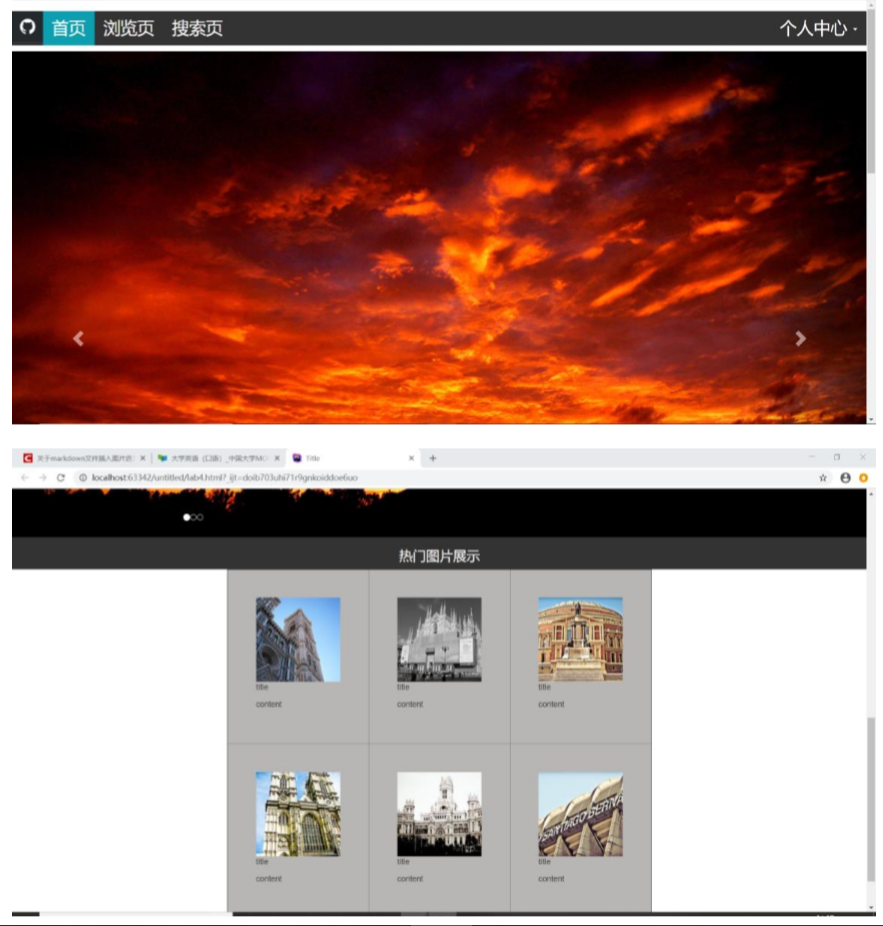

LAB 4 设计文档
==========
利用了Bootstrap的css样式，在pj的基础上添加了一些代码。

-------------------

## 关于轮播功能
先找了三张素材，然后按照找到Bootstrap里相应的class名，id="myCarousel" class="carousel slide"。
建立一个div，里面有三个部分，
<div id="myCarousel" class="carousel slide">
        <ol class="carousel-indicators">
            <li data-target="#myCarousel" data-slide-to="0" class="active"></li>
            <li data-target="#myCarousel" data-slide-to="1"></li>
            <li data-target="#myCarousel" data-slide-to="2"></li>
        </ol>
        <div class="carousel-inner">
            <div class="item active">
                
            </div>
            <div class="item">
                
            </div>
            <div class="item">
                
            </div>
        </div>
        <a class="left carousel-control" href="#myCarousel" role="button" data-slide="prev">
            <span class="glyphicon glyphicon-chevron-left" aria-hidden="true"></span>
            <span class="sr-only">Previous</span>
        </a>
        <a class="right carousel-control" href="#myCarousel" role="button" data-slide="next">
            <span class="glyphicon glyphicon-chevron-right" aria-hidden="true"></span>
            <span class="sr-only">Next</span>
        </a>
    </div>
-------------------

### 文件结构

```
/lab4
	/index.html
	/index.css
	/images
	/bootstrap-3.3.7-dist
	/lab4设计文档.md
```

-------------------
##主要结构

顶部是导航栏，与pj要求相同。个人中心是可以下拉的菜单。
下一层是三张风景图片，可以点击来换图片。
然后是由表格展示的6张风景图，内容还没有写。
最后是footer。

-----------------

## 作业效果图




