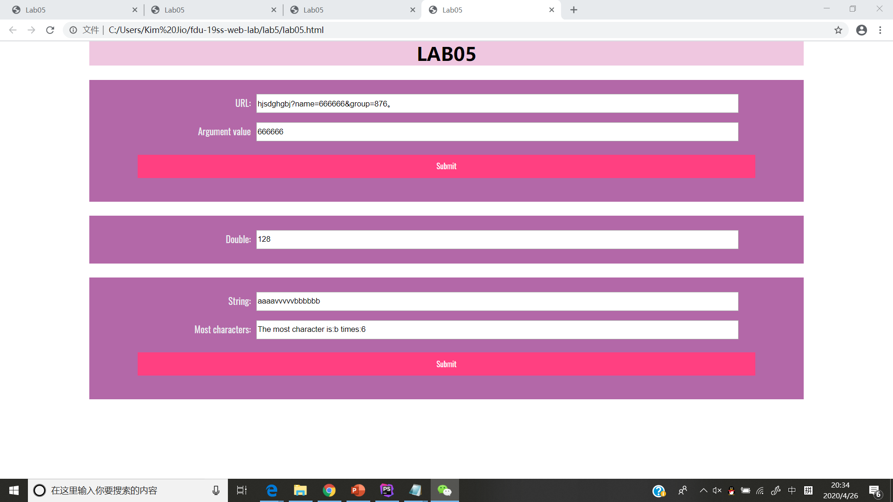

# Lab5设计文档

## 截图

## 第一题

一开始不知道怎么下手，找了其他同学询问。
url.value.split("&")用分开，分成好几个部分，变成数组。
url_useful[i].split("=");将asdf=qwe分成asdf ，qwe。
然后开始找name，如有就显示其name后面的字符串。

## 第二题

一开始值为1，然后用new Date()建立新的时间，获取second，然后用限制条件，
60 - seconds < 5，如果60-现在的秒数不小于5就不会执行。

## 第三题

先用for循环看看有没有重复的，有的话num++，
但是如果发现有更大的重复的话前面的就被覆盖。
一直循环，得到最大的数，输出对应的字符。