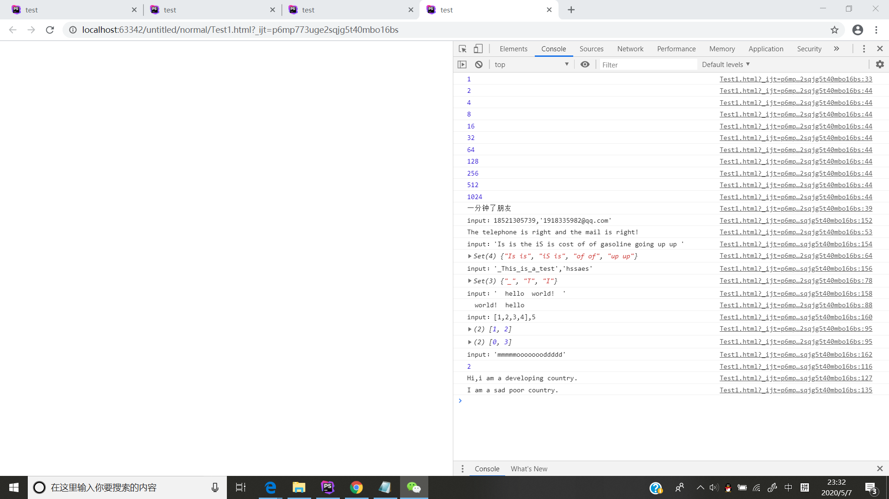

# Lab6设计文档

## 截图

## 第一题

一开始创建两个变量cou和val，一个用来计时间，一个用来输出值，给他们都各自创造add和get方法。
到了一分钟就会console一个“一分钟了朋友”。

## 第二题

正则表达式电话号=从1开始，在0~9之间的数字内，且为11位数字。
邮箱=以大写字母[A-Z]、小写字母[a-z]、数字[0-9]、下滑线[_]、减号[-]及点号[.]开头，并需要重复一次至多次[+]。
中间必须包括@符号。
@之后需要连接大写字母[A-Z]、小写字母[a-z]、数字[0-9]、下滑线[_]、减号[-]及点号[.]，并需要重复一次至多次[+]。
结尾必须是点号[.]连接2至4位的大小写字母[A-Za-z]{2,4}。

## 第三题

正则表达式=[a-z]+包括一个或多个字母，
\1 指定第一个子匹配项，局标记 g 指定将该表达式应用到输入字符串中能够查找到的尽可能多的匹配，
表达式的结尾处的不区分大小写 i 标记指定不区分大小写。

##继承不同方式的理解

一、原型链继承
二、借用构造函数继承
三、组合继承（组合原型链继承和借用构造函数继承）
四、原型式继承
五、寄生式继承
六、寄生组合式继承

##Map、Set、Array之间的区别和使用

array： 数组对象，是使用单独的变量名来存储一系列的值。
Set本身是一个构造函数，用来生成 Set 数据结构。
Set函数可以接受一个数组（或者具有 iterable 接口的其他数据结构）作为参数，用来初始化。
Map： ES6 提供了新的数据结构。它类似于对象，也是键值对的集合，但是“键”的范围不限于字符串，
各种类型的值（包括对象）都可以当作键。Map 结构提供了“值—值”的对应。